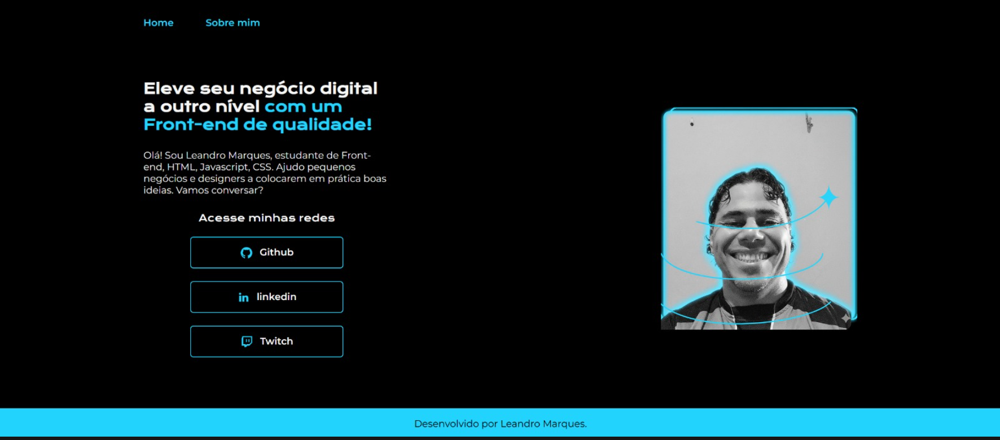

# 🧑‍💻 Portfólio HTML e CSS – Curso 3 Aula 5



Este projeto foi desenvolvido como parte do meu aprendizado em desenvolvimento Front-end. Ele representa um portfólio pessoal simples e moderno, construído com **HTML** e **CSS**, utilizando boas práticas de layout responsivo com **Flexbox**, tipografia personalizada com **Google Fonts**, e estilização clara e acessível.

## 🌐 Projeto online

Você pode visualizar o projeto publicado em:  
🔗 [https://LeandroJr1010.github.io/Portifolio-HTML-e-CSS-Curso3-aula_5/](https://LeandroJr1010.github.io/Portifolio-HTML-e-CSS-Curso3-aula_5/)

---

## 📌 Funcionalidades

- Página inicial com apresentação profissional
- Página "Sobre mim" com descrição pessoal e objetivos
- Links para redes sociais com ícones
- Layout responsivo com Flexbox
- Estilo visual moderno com cores contrastantes e fontes personalizadas

---

## 🛠️ Tecnologias utilizadas

- **HTML5**
- **CSS3**
- **Google Fonts** (`Krona One`, `Montserrat`)
- **Flexbox Layout Guide**
- Recursos e boas práticas aprendidas em:
  - [freeCodeCamp.org](https://www.freecodecamp.org/)
  - [W3Schools CSS](https://www.w3schools.com/w3css/)
  - [MDN Web Docs](https://developer.mozilla.org/)

---

## 📁 Estrutura de arquivos

📁 Portifolio-HTML-e-CSS-Curso3-aula_5/
├── index.html
├── about.html
├── styles/
│   └── [style.css](./styles/style.css)
├── assets/
│   ├── [imagem.png](./assets/imagem.png)
│   ├── github.png
│   ├── linkedin.png
│   └── twitch.png

---

## 🚀 Como visualizar

Você pode clonar este repositório e abrir o arquivo `index.html` em seu navegador:

```bash
git clone https://github.com/LeandroJr1010/Portifolio-HTML-e-CSS-Curso3-aula_5.git
```

---

## 🎯 Aprendizados

Este projeto me ajudou a consolidar conceitos fundamentais de desenvolvimento web, como:
- Estruturação semântica com HTML
- Estilização com CSS e uso de variáveis
- Layout responsivo com Flexbox
- Organização de arquivos em projetos reais
- Publicação de sites com GitHub Pages
- Documentação com Markdown para repositórios

---
## 🙌 Autor

Desenvolvido por **Leandro Marques**

- 📬 [GitHub](https://github.com/LeandroJr1010)  
- 🔗 [LinkedIn](https://www.linkedin.com/feed/)  
- 🎮 [Twitch](https://www.twitch.tv/)
